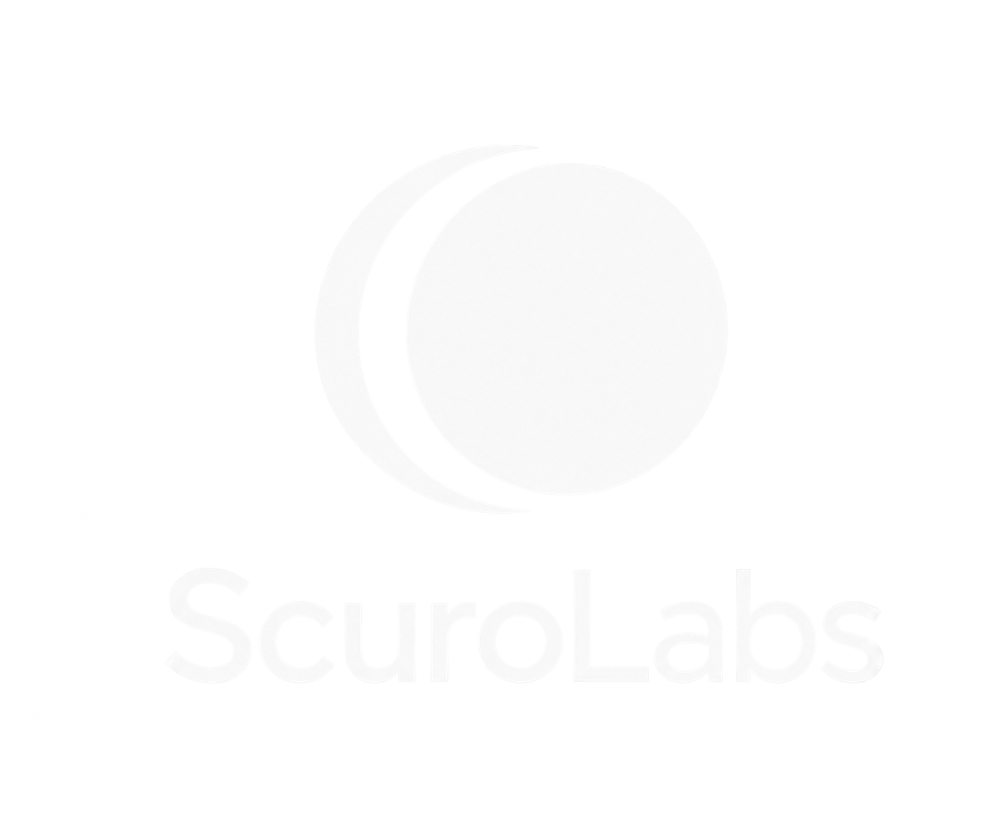

<p align="center">
  
</p>

<p align="center">
  <strong>Independent Noctalia plugins for Linux desktops.</strong><br>
  <sub>Small utilities and visual experiments.</sub>
</p>

<p align="center">
  <a href="#plugins">Plugins</a> ·
  <a href="#installation">Installation</a> ·
  <a href="#security">Security</a> ·
  <a href="#ai-development-disclosure">AI development</a> ·
  <a href="#contributing">Contributing</a>
</p>

---

## Overview

ScuroLabs is a maintainer-led collection of Noctalia plugins for Linux
desktops. Each plugin is reviewed for its behavior, system access, manifest,
documentation, and compatibility evidence before it is considered for release.

ScuroLabs is not a general plugin marketplace or a submission queue. General
plugin submissions should use Noctalia's community-plugin process.

## Plugins

| Plugin | What it does | Access | Status |
| --- | --- | --- | --- |
| **[I/O Usage](io-usage/)**<br>`scurolabs/io-usage` | Displays aggregate read and write throughput in a Noctalia bar. | Read-only `/proc/diskstats` and `/sys/block` | **1.3.12** |
| **[Radio Tellus](radio-tellus/)**<br>`scurolabs/radio-tellus` | Browses and plays internet radio by country, genre, and mood, with Favorites, Recent history, and optional Last.fm scrobbling. | Radio Browser, station streams, optional Last.fm access, local playback processes, and saved plugin data and Last.fm credentials | **0.9.50** |

## Installation

Add the ScuroLabs source while Noctalia is running:

```sh
noctalia msg plugins source add scurolabs git https://github.com/Scurolabs/scurolabs-plugins
```

Enable the plugins you want to use:

```sh
noctalia msg plugins enable scurolabs/io-usage
noctalia msg plugins enable scurolabs/radio-tellus
```

Check the source and enabled plugins:

```sh
noctalia msg plugins source list
noctalia msg plugins list
```

Update the source with `noctalia msg plugins update scurolabs`.

## Requirements

Requirements vary by plugin. Check the relevant plugin README for Linux,
Noctalia, hardware, dependency, and compatibility requirements.

## Security

> [!WARNING]
> Noctalia plugins run with the user's privileges. Noctalia does not provide a
> filesystem, process, network, or credential security sandbox for plugins.

Review the relevant plugin README before installation. Each plugin's security
disclosure records:

- files and directories it reads or changes;
- processes, network, credentials, and sensitive data it can access;
- persistence, authorization prompts, and other side effects.

## AI development disclosure

ScuroLabs uses substantial AI assistance throughout development, including code
drafting, documentation, and review support. The maintainer remains responsible
for understanding, reviewing, testing, making security decisions, and
maintaining the project.

## Compatibility

Compatibility evidence is recorded per plugin. A platform is not described as
tested unless dated maintainer or community evidence exists. Expected but
untested platforms remain identified as untested.

## Contributing

Outside contributions and public issue handling are not currently enabled for
ScuroLabs. A plugin may be considered after explicit maintainer review of its
behavior, access, compatibility, documentation, and release requirements.

## Licensing

Licensing is documented per plugin. Each plugin's README and `LICENSE` file
describe its terms and attribution.

---

<p align="center">
  <sub>ScuroLabs · Noctalia plugins for Linux desktops</sub>
</p>
