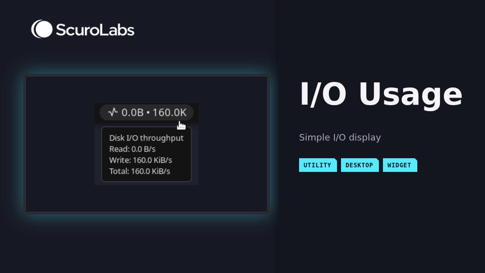

# I/O Usage

I/O Usage displays read, write, combined, or separate read/write throughput for
block devices recognized by the plugin in a Noctalia bar. It reads Linux kernel
counters and reports the calculated rates in memory without external commands,
network access, or plugin-owned persistent storage.



## Plugin / entries

| Field | Value |
| --- | --- |
| ID | `scurolabs/io-usage` |
| Entries | Bar widget: `bar`, service: `service` |

## Features

- Shows a compact read, write, combined, or separate read/write rate for
  recognized block devices in a bar widget.
- Can hide the activity glyph from the bar while keeping the value and tooltip.
- Can remove decimals from the bar value with mathematical rounding. The
  tooltip keeps its decimal precision.
- Displays the read/write split and the aggregate rate in the widget tooltip.
- Averages counter deltas over a configurable window without persisting a cache.
- Excludes the named device classes documented in Notes.

## Installation / ScuroLabs source

Add the ScuroLabs source and enable `scurolabs/io-usage` while Noctalia is
running:

```sh
noctalia msg plugins source add scurolabs git https://github.com/Scurolabs/scurolabs-plugins
noctalia msg plugins enable scurolabs/io-usage
```

Check that the source and plugin appear in these lists:

```sh
noctalia msg plugins source list
noctalia msg plugins list
```

The stable Noctalia source name is `scurolabs`. Update the source with:

```sh
noctalia msg plugins update scurolabs
```

## Requirements

Requires Linux with readable `/proc/diskstats` and `/sys/block` interfaces. The
widget reports unavailable data when no recognized block devices are found. The
manifest declares no external dependencies or commands, and the plugin
requires no authentication or root privileges.

## Usage

Enable `scurolabs/io-usage` and
add the `scurolabs/io-usage:bar` widget to a Noctalia bar. The widget displays
the rate selected by `display_mode`, with the combined total as the default.
The separate mode shows compact `read • write` values in that order, while the
tooltip always shows the read/write split and total. The `bar_rounding` setting
keeps decimals by default or rounds the bar value to the nearest whole number.
Values at `.5` round up. It does not change tooltip formatting. Enabling the
plugin also starts the singleton
`scurolabs/io-usage:service` entry.

The service requests an asynchronous `/proc/diskstats` read at one-second
intervals, lists available block devices through `/sys/block`, tracks counter
deltas and the selected averaging window in memory, and publishes the result
through Noctalia's in-memory state channel. The first valid counter read sets a
baseline. With the default one-second averaging window, the first rate appears
after accumulated valid elapsed time reaches one second. A longer averaging
window waits until that interval has completed. If the required kernel data
cannot be read, the widget reports unavailable data instead of displaying a
rate. A backward or unusually large wall-clock gap is treated as a sampling
discontinuity and re-baselines instead of affecting the rate.

If the recognized device set changes or an individual counter resets, the
service replaces its baseline, clears the averaging window, and reports
warming up until a valid interval has completed. A device-discovery failure
reports unavailable data and resets the sampler. Changing only the stability
settings does not change the sampling interval. Changing
`average_window_seconds` clears the baseline and averaging window before
sampling under the new effective interval.

## Screenshot


The branded thumbnail contains a screenshot of the working widget and tooltip.

## Settings

These are plugin-level settings, available in Settings > Plugins.

| Setting | Type | Default | Description |
| --- | --- | --- | --- |
| `show_glyph` | `bool` | `true` | Show the EKG-style activity glyph before the bar value. |
| `display_mode` | `select` | `combined` | Show `read`, `write`, the combined total, or separate compact `read • write` values. |
| `bar_rounding` | `select` | `none` | Keep decimals, or round the bar value to the nearest whole number. The tooltip is not rounded. |
| `stability_mode` | `select` | `adaptive` | Select `adaptive` sizing or `fixed` width for the value column. |
| `stability_width` | `int` | `80` px | Reserved value-column width from 40 to 240 px. Used when `stability_mode` is `fixed`. |
| `average_window_seconds` | `int` | `1` second | Requests samples once per second and publishes a time-weighted average after the selected 1 to 60 second window completes. |

## IPC

Not applicable. The plugin exposes no custom IPC actions beyond the normal bar
widget configuration.

## Compatibility

| Status | Platform / environment | Evidence |
| --- | --- | --- |
| Tested | Devuan 6 + OpenRC, Noctalia v5.2.0, Umbriel compositor | Maintainer confirmed the current version's bar display and tooltip working on 2026-10-02. The installed Noctalia version was verified with `noctalia --version`. |
| Expected but untested | Other Linux systems with standard `/proc/diskstats` and `/sys/block` interfaces | The code has no init-system integration. No runtime evidence is recorded. |
| Community-tested | None | No community test evidence recorded |

## Security / system access

Noctalia runs this plugin with the user's privileges and does not provide a
security sandbox for plugins. This plugin reads `/proc/diskstats` and lists
`/sys/block` to obtain aggregate kernel disk counters. The plugin code writes
no files, caches, or plugin-owned logs. Noctalia persists the six selected
plugin settings in its own configuration storage. Counter state and averaging
data remain in the service runtime's memory. Published samples use Noctalia's
in-memory state channel, which is cleared when the plugin stops.

The plugin starts no processes, runs no external commands, makes no network
requests or telemetry transmissions, accesses no credentials, keyrings, tokens,
or personal data, and requires no root or administrator authorization. It
triggers no authorization prompts. It uses Noctalia's in-memory state channel
and bar rendering only. It does not invoke D-Bus, compositor, or device-control
APIs and does not modify hardware or system configuration.

## AI development disclosure

This plugin was developed with substantial AI assistance. The human maintainer is
responsible for understanding, reviewing, testing, making security decisions,
and maintaining the code.

## License

This plugin is licensed under MIT. Copyright (c) 2026 scurolabs. The complete
license text is in `LICENSE`.

## Contributing

Outside contributions are not currently enabled. General new-plugin
submissions should use Noctalia's community-plugin process rather than
treating ScuroLabs as an intake queue.

## Notes

The plugin excludes device names matching `dm-<digits>`, `loop<digits>`,
`md*`, `ram<digits>`, `zram<digits>`, and `sr<digits>`. These name filters do
not identify every possible virtual
or duplicate layer. The plugin reports unavailable data when
`/proc/diskstats` cannot be read or no recognized block device is found. Device
set changes and counter resets temporarily re-baseline instead of producing a
synthetic rate. A backward or unusually large wall-clock gap also re-baselines.
The plugin does not retain counter data after its service runtime is stopped,
and Noctalia clears the published state when the plugin stops.
