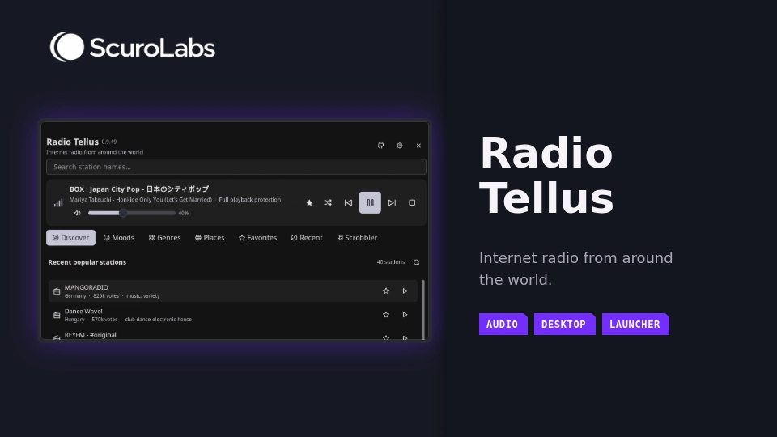
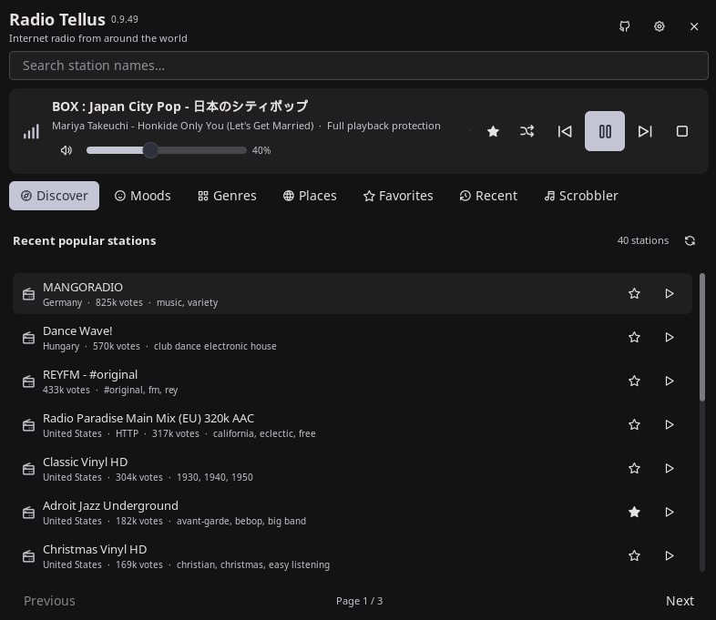

# Radio Tellus

Radio Tellus browses and plays community-maintained internet radio by country,
genre, and mood. It provides recent popular stations, Favorites, Recent
history, and optional Last.fm scrobbling.



## Plugin / entries

| Field | Value |
| --- | --- |
| ID | `scurolabs/radio-tellus` |
| Entries | Bar widget: `bar`, panel: `panel`, service: `player-status`, service: `library-state`, launcher provider: `launcher` |
| Launcher Prefix | `/radio` |

## Features

- Browse and search stations by country, genre, mood, name, or tag.
- Play stations, reorder Favorites, and maintain Recent history.
- Control playback and volume from the panel and bar, with optional status display.
- Link Last.fm for Now Playing updates and scrobbling.
- Check stream destinations before playback, with optional Bubblewrap isolation.

## Installation / ScuroLabs source

Install the requirements below first. Then add the ScuroLabs source and enable
Radio Tellus while Noctalia is running:

```sh
noctalia msg plugins source add scurolabs git https://github.com/Scurolabs/scurolabs-plugins
noctalia msg plugins enable scurolabs/radio-tellus
```

Use these commands to check that your source and `scurolabs/radio-tellus` appear
in the lists:

```sh
noctalia msg plugins source list
noctalia msg plugins list
```

The background services start automatically when you enable the plugin.

Update the source with:

```sh
noctalia msg plugins update scurolabs
```

## Requirements

Before using playback or Last.fm, install these commands from your distribution
and make them available on `PATH`: `bash`, `chmod`, `dirname`, `env`, `head`,
`ip`, `mkdir`, `mktemp`, `mpv`, `python3`, `rm`, `rmdir`, `setpriv`, `sh`,
`sleep`, `socat`, `stat`, and `xdg-open`. Radio Tellus does not install them.
A working PulseAudio-compatible audio service is also required.

Some helpers use fixed paths: `/usr/bin/bash`, `/usr/bin/sh`,
`/usr/bin/python3`, `/usr/bin/socat`, `/usr/bin/head`, `/usr/bin/sleep`,
`/usr/bin/chmod`, `/usr/bin/mktemp`, and `/usr/bin/xdg-open`. The network helper
looks for `ip` under `/usr/bin`, `/usr/sbin`, `/bin`, or `/sbin`. Playback
executables resolved by `stream-session` (`mpv`, `setpriv`, `env`, `bash`, and
`python3`) must be owned by root and not writable by group or other users.
`stat` must be executable under `/usr`.

`bwrap` is optional. Automatic isolation uses Full mode when `bwrap` works and
falls back to Compatible mode otherwise.

## Usage

Add `scurolabs/radio-tellus:bar` under Settings > Bar, then click it to open the
panel. Right-click to stop playback, scroll to change volume, and middle-click
to open widget settings. Turn off **Show playback status** to keep the bar
glyph fixed.

Browse Discover, Moods, Genres, Places, Favorites, and Recent. Search by
station name, country, or tag, then press Enter. Drag a favorite by its grip
icon to reorder it. Drop it on Previous or Next to move it across pages. Your
order is saved. The Random button finds a fresh station without replacing the
current list. HTTPS is the default. To play an HTTP stream, enable **Allow
unencrypted HTTP streams**.

Click the GitHub icon in the panel header to open the public ScuroLabs plugins
repository in your browser.

Open the panel from a terminal with:

```sh
noctalia msg panel-toggle scurolabs/radio-tellus:panel
```

To link Last.fm, open the Scrobbler tab and enter an API key and shared secret.
Choose **Save API credentials**, then **Authorize Last.fm**. Approve access in
your browser and choose **Complete Last.fm authorization** in the panel. Radio
Tellus never asks for your Last.fm password. Unsaved credentials stay in
memory. If you close the panel during authorization, reopen Scrobbler to finish.
The pending authorization stays in memory while Noctalia is running.

Track details must stay unchanged for the **Last.fm metadata confirmation
delay** in Settings. Last.fm must confirm the artist and title without
corrections. Tracks of 30 seconds or less are skipped. Other tracks need enough
play time to qualify, and pauses do not count. Some Last.fm failures are
retried. Changing to a different Last.fm username clears the old account's
queued tracks.

Open **Recent scrobbles** to see tracks Last.fm accepted during the current
player-status session. It does not show your full Last.fm history. Recent
entries have **Copy** and **Open Last.fm** buttons. **Songs saved this session**
counts accepted tracks only.

Type `/radio` to use these launcher actions:

- **Open Radio Tellus** toggles the panel.
- **Play a random station** selects from the cached Discover list.
- Favorites can be searched by station name, country, or tag and played
  directly, for example `/radio jazz`.

Set keyboard shortcuts in Radio Tellus Settings. They work while the panel is
focused and can change stations, control playback, play a random station,
toggle Favorites, and mute audio.

## Screenshot



Repository-backed screenshot of the working plugin. It shows the Discover view
during playback.

## Settings

| Setting | Type | Default | Description |
| --- | --- | --- | --- |
| `startup_view` | `select` | `discover` | View selected when the panel opens. |
| `station_limit` | `int` | `40` | Maximum stations shown in station lists and search results. |
| `history_limit` | `int` | `30` | Number of Recent stations retained. Set to `0` to disable history. |
| `row_click_action` | `select` | `play` | Play a station immediately or only select it. |
| `stop_on_panel_close` | `bool` | `false` | Stop playback when the panel closes, except while opening settings. |
| `cache_hours` | `int` | `6` | Hours station lists may be reused. |
| `allow_insecure_http` | `bool` | `false` | Allow unencrypted HTTP streams. HTTPS remains the default. |
| `isolation_mode` | `select` | `auto` | Choose Automatic, Full, or Compatible isolation for playback. |
| `report_clicks` | `bool` | `true` | Report successful playback to Radio Browser after audio starts. |
| `lastfm_confirmation_seconds` | `int` | `30` | Seconds confirmed metadata must remain stable before Last.fm validation. |
| `lastfm_send_now_playing` | `bool` | `true` | Send a track to Last.fm after it confirms the artist and title. |
| `lastfm_retry_interval_seconds` | `int` | `60` | Seconds between retries for temporary Last.fm failures. |
| `shortcut_previous` | `select` | `Up` | Panel shortcut for the previous station. |
| `shortcut_next` | `select` | `Down` | Panel shortcut for the next station. |
| `shortcut_play` | `select` | `none` | Optional shortcut for playing the selected station. |
| `shortcut_toggle` | `select` | `space` | Panel shortcut for toggling playback. |
| `shortcut_random` | `select` | `r` | Panel shortcut for playing a random station. |
| `shortcut_favorite` | `select` | `f` | Panel shortcut for toggling a favorite. |
| `shortcut_mute` | `select` | `m` | Panel shortcut for toggling mute. |
| `glyph` | `glyph` | `radio` | Bar glyph used when stopped or status display is off. |
| `show_playback_status` | `bool` | `true` | Show connecting, playing, paused, and silent states in the bar. |
| `show_station_name` | `bool` | `true` | Show the current station name in the bar. |
| `station_name_limit` | `int` | `24` | Maximum Unicode characters shown for the bar station name. |
| `volume_step` | `int` | `5` | Volume percentage points changed per bar wheel step. |

## IPC

After the panel entry has loaded in the current Noctalia session, these commands
are available. The `random` action can start playback even when the panel is
currently closed.

```sh
noctalia msg plugin scurolabs/radio-tellus:panel all random
noctalia msg plugin scurolabs/radio-tellus:panel all discover
noctalia msg plugin scurolabs/radio-tellus:panel all scrobbler
```

## Compatibility

| Status | Platform / environment | Evidence |
| --- | --- | --- |
| Tested | Devuan 6 + OpenRC, Noctalia v5.2.0, Umbriel compositor | Maintainer confirmed runtime testing on 2026-10-02. The installed Noctalia version was verified with `noctalia --version`. |
| Expected but untested | Other Linux systems with a PulseAudio-compatible audio service and the declared commands | No runtime evidence is recorded. |
| Community-tested | None | No community test evidence is recorded. |

## Security / system access

Radio Tellus runs with your user privileges, and Noctalia does not sandbox
plugins. It saves Favorites, Recent history, volume and mute settings, station
cache, playback recovery data, the scrobble retry queue, and saved Last.fm
credentials in its plugin data folder. Credential files use mode `0600`. If
Radio Tellus cannot enforce that permission, it will not read or save them.
Compatible playback creates a short-lived local proxy token. It stores the
token in temporary files and removes them during normal cleanup. Playback
diagnostics use the `radio-tellus playback` label in Noctalia's log. Entries
omit station and track names.
Noctalia controls log retention.

Radio Tellus launches Bash or `sh`, MPV, Python, `setpriv`, `socat`, and
Bubblewrap when Full isolation is used. It also uses `chmod`, `dirname`, `env`,
`head`, `ip`, `mkdir`, `mktemp`, `rm`, `rmdir`, `sleep`, and `stat`. It uses
Noctalia IPC and the existing PulseAudio-compatible Unix socket. It opens
Last.fm pages and the public ScuroLabs plugins repository with
`/usr/bin/xdg-open` when requested. The GitHub icon opens
`https://github.com/Scurolabs/scurolabs-plugins` in your browser. It does not
need root, install packages, or change system configuration.

Catalog, search, station details, and optional playback click reports go to
Radio Browser at `https://all.api.radio-browser.info`. Last.fm requests go to
`https://ws.audioscrobbler.com`, and browser authorization opens
`https://www.last.fm`. When you listen, station servers see your connection
and the `Radio-Tellus` user agent. Audio and redirects pass through a proxy
that checks destinations. HTTPS is used by default. Private and local
destinations are rejected. HTTP playback requires enabling **Allow unencrypted
HTTP streams**.

Last.fm receives validated artist and title metadata, optional catalog data,
playback timing, and account authentication. Station URLs are not sent to
Last.fm. Radio Tellus does not access unrelated credentials, keyrings, private
keys, or personal files, and sends no other telemetry beyond the documented
Radio Browser click reports and Last.fm requests.

Compatible mode uses the validating proxy but is not a formal sandbox. Full
mode adds network, process, IPC, hostname, and filesystem isolation. It does
not change system settings. Only playback executables resolved by
`stream-session` are checked for ownership and write access. Browser and
storage commands do not receive those checks. MPV handles untrusted streams.

## AI development disclosure

AI tools helped develop this plugin. The human maintainer is responsible for
understanding, reviewing, testing, security decisions, and maintenance.

## License

This plugin is licensed under MIT. Playback isolation code adapted from Radio
Atlas is credited in `THIRD_PARTY_NOTICES.md`.

## Contributing

This plugin is a maintainer project and is not accepting outside
contributions yet. To suggest a different plugin, use Noctalia's community
plugin process.

## Notes

Playback will not start if a required command, audio service, proxy, or station
is unavailable. Retryable scrobbles are saved in a bounded queue for the linked
Last.fm account. Last.fm's terms limit Last.fm Data use to non-commercial
purposes. Public pages using Last.fm services need written approval, and
attribution button and link placement is subject to approval. Read the
[Last.fm API Terms of Service](https://www.last.fm/api/tos) before using Last.fm.
